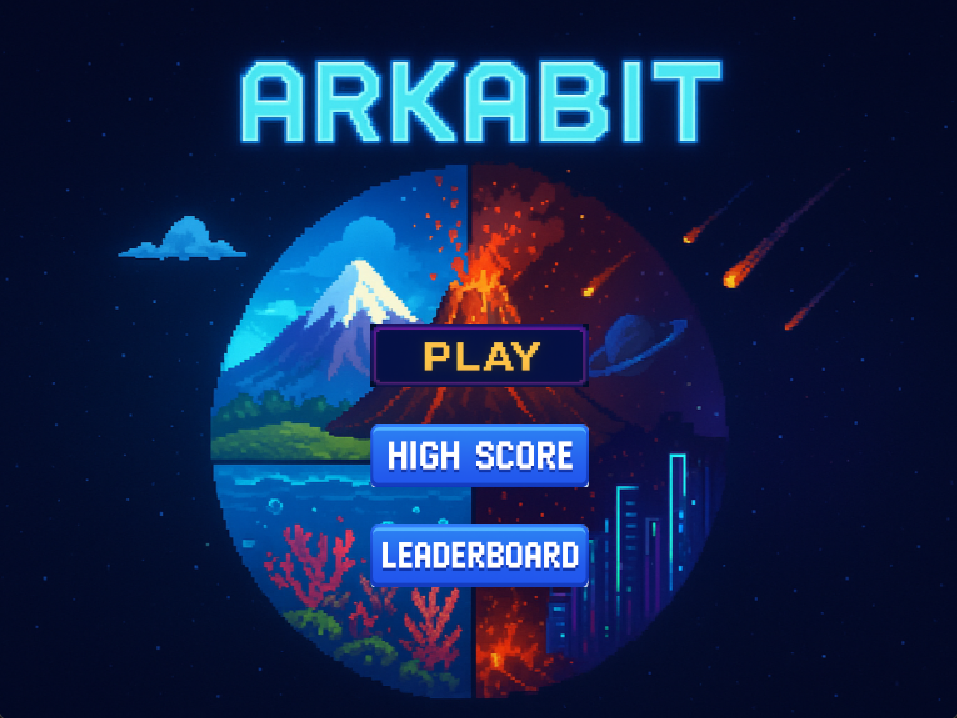
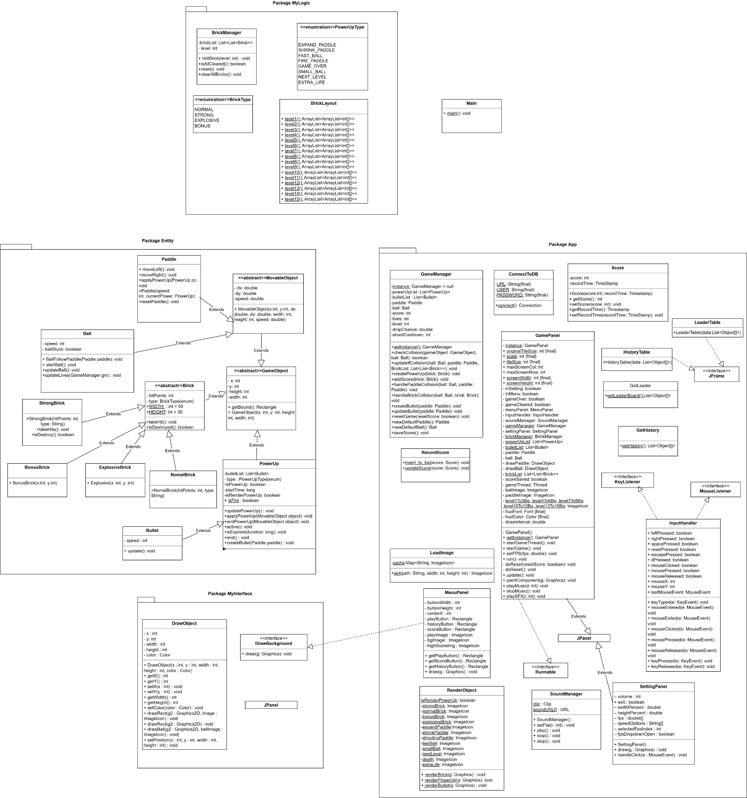

# Arkabit Project

## Overview
This is a Java implementation of the classic Arkanoid game, developed using Object-Oriented Programming principles. Key OOP concepts used in this project include: Inheritance, Encapsulation, Polymorphism, Design patterns, etc.

---

## Video Demo
The video demonstrates:

---

## Design Document
### Class Diagram
The system design includes:

---

## Team Members
1. **Team Leader**: Nguyen Huu Tung - 24021663 -
2. **Member 2**: Hoang Long Vu - 24021679 -
3. **Member 3**: Nguyen Duc Quang - 24021607 -